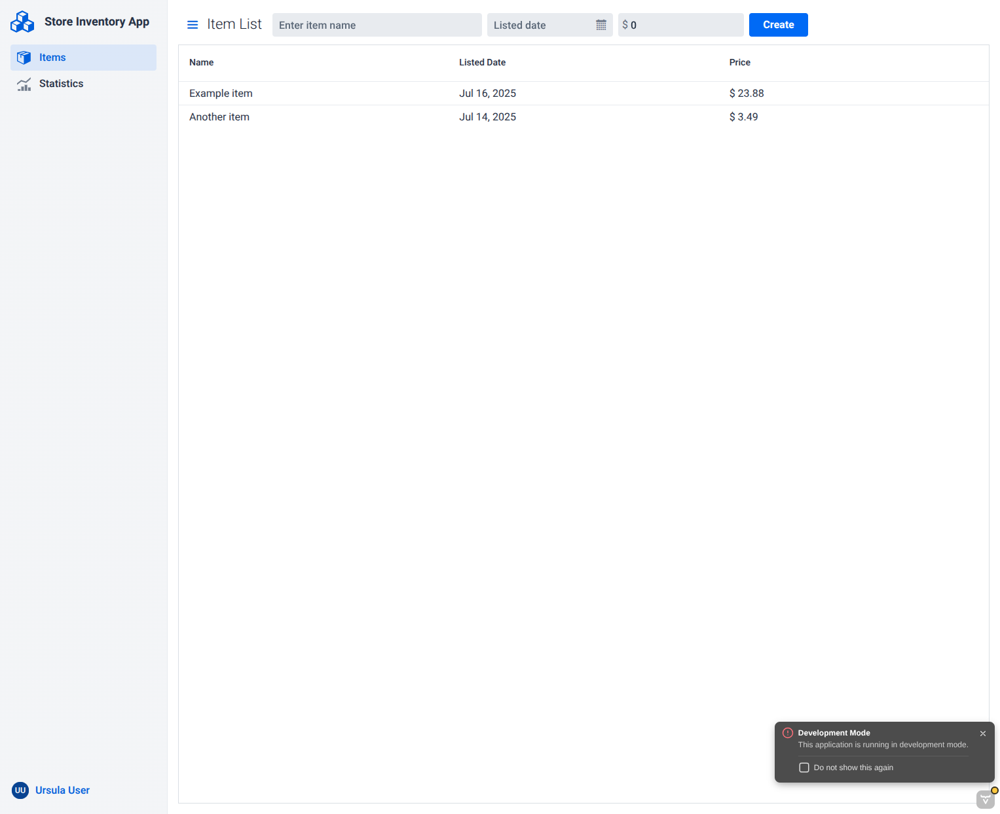
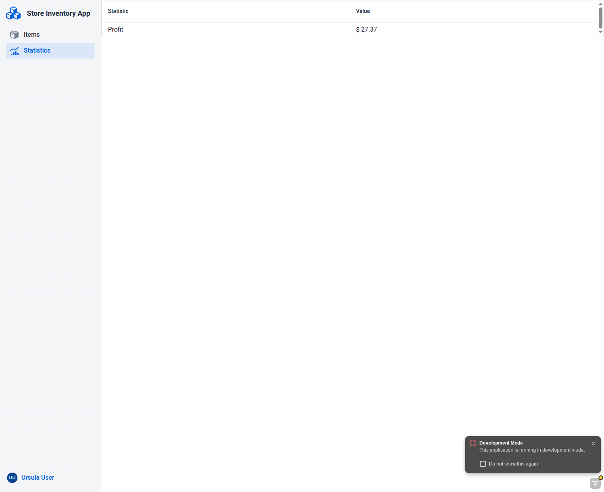

# Store Inventory App README

## Features
- Vaadin
- Total profit statistic

## Running the App

To start the application in development mode, import it into your IDE and run the `Application` class. 
You can also start the application from the command line by running: 

```bash
./mvnw
```

To build the application in production mode, run:

```bash
./mvnw -Pproduction package
```

Open [http://localhost:8080/dev-login](http://localhost:8080/dev-login) and follow instructions.

### Spotless

```bash
./mvnw spotless:check
```

```bash
./mvnw spotless:apply
```

## Screenshots




